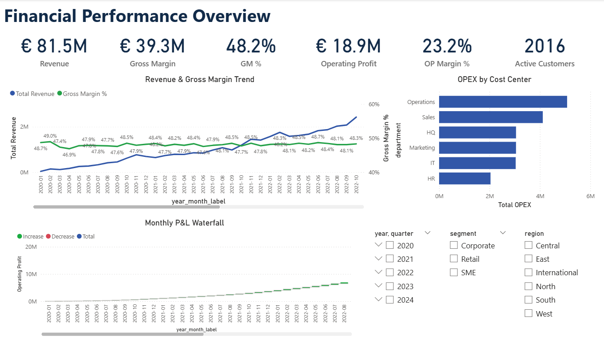
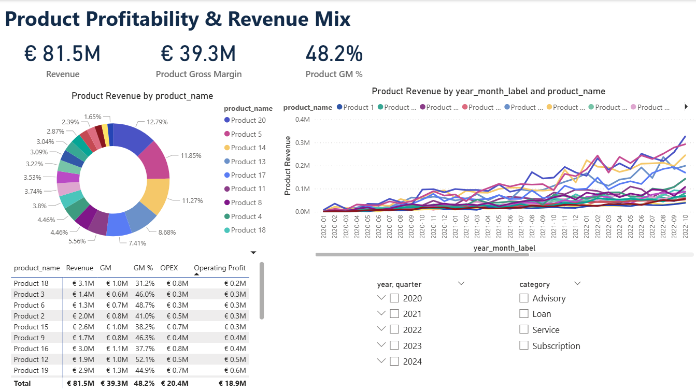
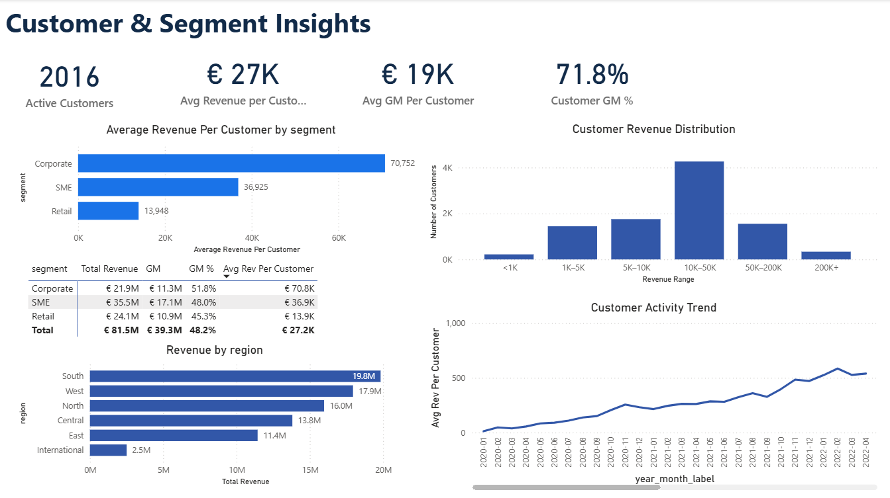
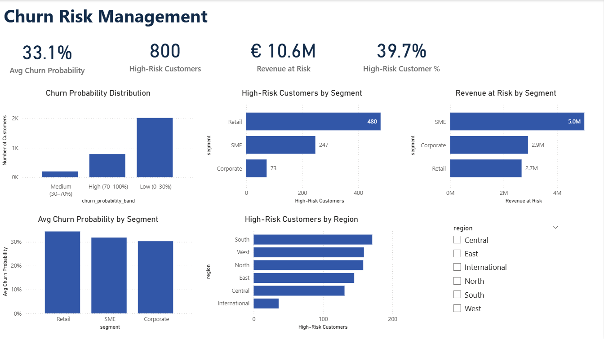
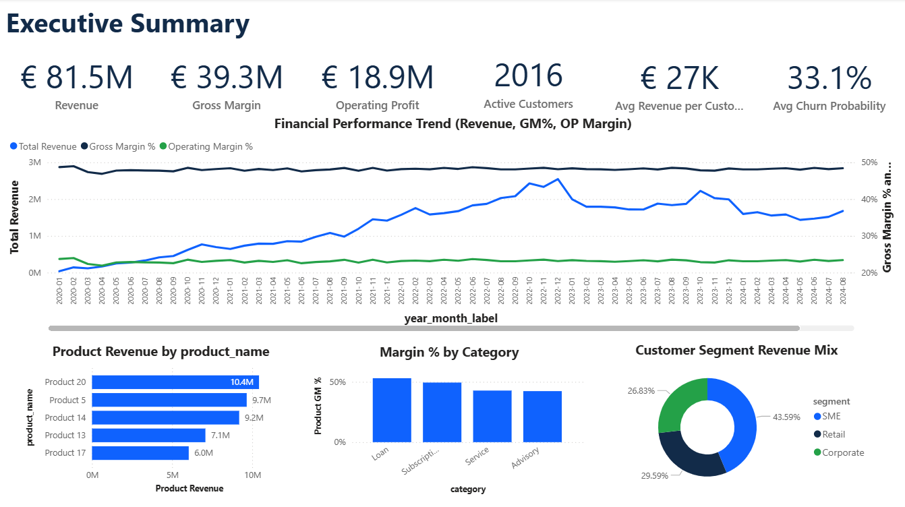

# Enterprise Financial KPI & Churn Analytics Platform

*A modern finance analytics solution integrating data engineering, profitability modeling, and customer churn prediction — designed for banking and financial institutions.*

---

## 🧭 Executive Summary

This project delivers an **end-to-end financial analytics platform** that:

1. **Simulates realistic enterprise financial data**  
2. **Builds a curated SQL KPI layer in DuckDB**  
3. **Trains a machine-learning churn model** on customer behavior  
4. **Exports everything into Power BI** for executive-grade dashboards  

It reflects analytical patterns used within **banks, fintechs, insurance firms, and FP&A departments**, while relying on **synthetic data** so there are no confidentiality or GDPR issues.

---

## 🏦 Industry Context & Business Problem

Financial institutions face increasing pressure to:

### 1. Improve profitability transparency

Executives need timely insight into:

- Revenue and margin drivers  
- OPEX allocation across products and cost centers  
- Customer and segment profitability  

In many organizations, fragmented systems and manual Excel processes delay decision-making.

### 2. Understand and reduce customer churn

Retail and SME banking churn has increased due to:

- Strong competition and digital-only challengers  
- Rate-sensitive customers  
- Post-COVID behavior shifts  

Predicting churn is strategically critical but depends on a unified analytic data foundation.

### 3. Modernize financial data platforms

Banks increasingly adopt:

- **DuckDB** for fast analytical prototyping  
- **Python** for data generation and modeling  
- **SQL-based KPI layers** as a semantic foundation  
- **Power BI** as the front-end for FP&A and management reporting  

This project demonstrates a **practical, modern architecture** aligned with these trends.

---

## 🧩 Solution Overview

The platform integrates four main components:

1. **Synthetic Financial Data Generator (Python)**  
   - Multi-year transactional and financial data  
   - Segments, regions, risk scores  
   - Seasonality, macro shocks (COVID, recovery, inflation)

2. **DuckDB Financial Data Warehouse (SQL)**  
   - Clean star schema  
   - Core FP&A KPI views (P&L, product profitability, segment performance)

3. **Churn Prediction Model (Python + scikit-learn)**  
   - Feature engineering from customer activity  
   - RandomForest classifier  
   - Churn probabilities and risk bands per customer

4. **Power BI Executive Dashboards**  
   - Integrated view of **P&L, product, customer, and churn risk**  
   - 5 professional pages used for storytelling with CFOs and business leaders

---

## 🏗️ Architecture Diagram

```bash
# ==========================================================
#            ENTERPRISE FINANCIAL KPI PLATFORM
# ==========================================================

[SYNTHETIC DATA GENERATION — Python]
    ├── generate/time.py
    ├── generate/customers.py
    ├── generate/products.py
    ├── generate/transactions.py
    ├── generate/financials.py
    └── synthetic_pipeline.py
                     │
                     ▼
[DUCKDB DATA WAREHOUSE — SQL]
    ├── 01_schema_and_staging.sql        # Load raw data & build schema
    ├── 02_core_kpis.sql                 # P&L, Revenue, COGS, OPEX,
    │                                      # Customer KPIs, Revenue Bands
    └── 03_product_profitability.sql     # OPEX allocation & product profitability
                     │
                     ▼
[ML — Churn Prediction Model]
    └── churn_model.py                   # Feature engineering, model training,
                                         # churn probability bands
                     │
                     ▼
[EXPORT LAYER — SQLite]
    └── export_to_sqlite.py              # Creates finance.sqlite incl. predictions
                     │
                     ▼
[POWER BI ANALYTICS]
    ├── Page 1 — Financial Performance Overview
    ├── Page 2 — Product Profitability & Revenue Mix
    ├── Page 3 — Customer & Segment Insights
    ├── Page 4 — Churn Risk Management
    └── Page 5 — Executive Summary Dashboard
```

## 🧱 Data Engineering Workflow
### 1. Synthetic Data Generation (Python)  

Creates realistic financial datasets `data/draw`:  
- `dim_time` - calendar, year-month keys and labels  
- `dim_customer` - segments, regions, risk scores, lifecycle flags  
- `dim_product` - products, categories, pricing, cost ratios  
- `fact_transactions` - revenue, direct cost, seasonality, macro shocks  
- `fact_financials` - GL-style postings, OPEX by cost center & account  

Run:
```bash
uv run python -m src.synthetic_pipeline
```
### 2. DuckDB Warehouse & SQL KPI Layer  

**Load raw data and build star schema:**  
```bash
duckdb finance.duckdb -c ".read 'sql/01_schema_and_staging.sql'"
```

**Create core financial KPI views:**
```bash
duckdb finance.duckdb -c ".read 'sql/02_core_kpis.sql'"
duckdb finance.duckdb -c ".read 'sql/03_product_profitability.sql'"
```

Key analytical views include:  
- `vw_pnl_monthly`  
   Monthly P&L: revenue, COGS, OPEX, gross margin, operating profit  
- `vw_product_profitability`
   Product revenue & COGS, monthly revenue share, OPEX allocated by revenue share, operating profit    
- `vw_customer_profitability` 
   Customer-level lifetime value with **revenue bands:**  
      - `<1K`, `1K-5K`, `5K-10K`, `10K-50K`, `50K-200K`, `200K+`
      - Sorted using `revenue_band_sort` for clean visuals.
- `vw_customer_activity_monthly`  
   Monthly activity features (revenue, COGS, number of transactions) used by the churn model.  


## 🤖 Machine Learning: Churn Prediction  

The churn model includes two components:

### 1. Production Model Pipeline (`src/ml/churn_model.py`)  

This script:  
- Extracts customer features from DuckDB  
- Builds and trains the RandomForest model  
- Scores the full customer base  
- Generates churn probability bands  
- Writes predictions back into DuckDB (`predicted_churn`)  
- Exports `predicted_churn.csv` for Power BI  

Run:
```bash
uv run python -m src.ml.churn_model
```

### 2. Analysis Notebook (`src/ml/churn_analysis.ipynb`)  

A Jupyter notebook is included for:  
- Exploratory data analysis (EDA)  
- Distribution checks  
- Feature importance visualization  
- Churn probability exploration  
- Business impact analysis (Revenue at Risk, Segment risk, etc.)  

The notebook **imports and uses the production model** but adds richer diagnostics and visual storytelling for stakeholders.  

Run interactively using VS Code or Jupyter Lab.

## 🗂️ Export to Power BI

Use the export script:  
```bash
uv run python -m src.export_to_sqlite
```

This creates:  
```bash
finance.sqlite
```

The SQLite file exposes:  
   - All **dimension** and **fact** tables  
   - KPI SQL views (`vw_*`)  
   - The `predicted_churn` table with ML outputs  
Power BI connects directly to `finance.sqlite` via the built-in SQLite connector or an ODBC driver.  


## 📊 Power BI Executive Dashboard

The repository includes:  
- `dashboards/Enterprise_Financial_KPI_Platform.pbix` – main report file  
- `dashboards/Executive_Dashboard_Report.pdf` – exported multi-page PDF  
- `dashboards/*.png` – static page screenshots for GitHub and CV  

### 1. Financial Performance Overview  
*Revenue, GM, OPEX, Operating Profit & OPEX by cost center*  


### 2. Product Profitability & Revenue Share  
*Revenue by product, GM%, and allocated OPEX*  


### 3. Customer & Segment Insights  
*ARPU, customer GM%, revenue bands, region breakdown*  


### 4. Churn Risk Management  
*Churn probability distribution, high-risk customers, revenue at risk*  


### 5. Executive Summary Dashboard
*Single-page overview for CFOs and senior management*  



## 🏦 Relevance to Banking & Finance in Frankfurt

This platform directly mirrors priorities of large financial institutions headquartered in Frankfurt:  
**1. Profitability Transparency** — (Deutsche Bank, Commerzbank, DZ Bank)  
- Cost-income ratio, operating profit  
- Product and segment profitability  
- OPEX allocation by cost center and department  

**2. Customer Churn Analytics** — (ING-DiBa, Commerzbank, neobanks)  
- Behavioral feature engineering  
- Risk scoring at customer-level  
- Clear integration into BI for frontline teams  

**3. FP&A Digitization** — (KfW, Helaba, Allianz)  
- SQL-based KPI semantic layer  
- Power BI as a self-service reporting front-end  
- Python/DuckDB as a modern analytics stack  

**4. Regulatory Constraints on Real Data**  
- All data is synthetic but reflects realistic macro patterns (2020–2024)  
- Suitable for portfolio demonstrations, PoCs, and internal training  

## 🛠️ How to Run the Entire Platform (Summary)

```bash
# 1. Generate synthetic dataset
uv run python -m src.synthetic_pipeline

# 2. Build DuckDB warehouse & KPI views
duckdb finance.duckdb -c ".read 'sql/01_schema_and_staging.sql'"
duckdb finance.duckdb -c ".read 'sql/02_core_kpis.sql'"
duckdb finance.duckdb -c ".read 'sql/03_product_profitability.sql'"

# 3. Train churn model and write predicted_churn
uv run python -m src.ml.churn_model

# 4. Export all tables & views to SQLite for Power BI
uv run python -m src.export_to_sqlite
```

Then open **Power BI Desktop** and connect to `finance.sqlite` to refresh the report.

## 🎓 Skills Demonstrated  

This project demonstrates a balanced blend of finance expertise and technical capability:

**Finance & FP&A**  
- P&L modeling and variance analysis  
- Cost allocation (OPEX vs. COGS)  
- Product and segment profitability  
- Customer lifetime value and churn analytics  

**Data Engineering**  
- Python + DuckDB pipeline design  
- Star schema and KPI semantic modeling  
- SQL transformations and view-based data marts  
- Automated export for BI tools  

**Machine Learning**  
- Feature engineering from transactional data  
- Churn classification (RandomForest)  
- Model evaluation and calibration  
- Operationalization of scores into BI dashboards  

**Business Intelligence**  
- Power BI data modeling and DAX measure layer (via Tabular Editor)  
- Multi-page executive dashboard design  
- Slicers, interactions, and storytelling for senior stakeholders  

## 🧾 Repository Structure
```bash
enterprise-financial-kpi-platform/
├── data/
│   ├── raw/                 # Generated CSVs for dimensions & facts
│   └── processed/           # ML outputs (predicted_churn.csv, etc.)
├── dashboards/
│   ├── Enterprise_Financial_KPI_Platform.pbix
│   ├── Executive_Dashboard_Report.pdf
│   ├── page1_overview.png
│   ├── page2_product_profitability.png
│   ├── page3_customer_segments.png
│   ├── page4_churn_risk.png
│   └── page5_executive_summary.png
├── sql/
│   ├── 01_schema_and_staging.sql
│   ├── 02_core_kpis.sql
│   └── 03_product_profitability.sql
├── src/
│   ├── generate/            # Synthetic data generation modules
│   ├── ml/
│   │   ├── churn_model.py            # Production churn pipeline
│   │   └── churn_analysis.ipynb      # Analysis & diagnostics notebook
│   ├── synthetic_pipeline.py
│   ├── export_to_sqlite.py
│   └── config.py
├── semantec_model/
│   └── create_measures.cs   # Tabular Editor script for DAX measures
├── finance.duckdb           # DuckDB analytical database
└── finance.sqlite           # BI-ready SQLite export
```

## 📚 Citation
> Sanaev, G. (2025). *Enterprise Financial KPI & Churn Analytics Platform.*  
> GitHub Repository: [https://github.com/gsanaev/enterprise-financial-kpi-platform](https://github.com/gsanaev/enterprise-financial-kpi-platform)

---

## 📞 Contact

**GitHub:** [@gsanaev](https://github.com/gsanaev)  
**Email:** gsanaev80@gmail.com  
**LinkedIn:** [golib-sanaev](https://linkedin.com/in/golib-sanaev)