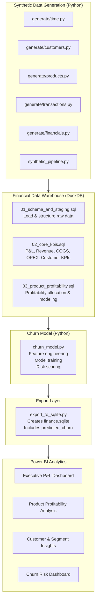

# Enterprise Financial KPI & Churn Analytics Platform

*A modern finance analytics solution integrating data engineering, profitability modeling, and customer churn prediction — designed for banking and financial institutions.*

## 🧭 Executive Summary

This project delivers an **end-to-end financial analytics platform** that simulates realistic enterprise financial data, models profitability using a curated SQL KPI layer, predicts customer churn using machine learning, and presents insights through an executive-grade Power BI dashboard.

The platform combines:
- **Data Engineering** (Python, DuckDB, SQL)  
- **Financial Analytics** (P&L, product profitability, segment analysis)  
- **Customer Churn Prediction** (ML model integrated into BI)  
- **Business Intelligence** (Power BI executive dashboards)  

It reflects the analytical patterns used within **banks, fintechs, insurance firms, and FP&A departments** — and uses **synthetic data** to avoid regulatory limitations while preserving realistic financial behavior.

## 🏦 Industry Context & Business Problem

Financial institutions face increasing pressure to:

### 1. Improve profitability transparency

Executives require timely insights into:
- Revenue and margin drivers  
- Cost allocation across products and segments  
- Customer profitability and lifetime value  

Fragmented systems and manual reporting often delay decision-making.

### 2. Understand and reduce customer churn

Retail and SME banking churn rates in Europe have risen due to:
- High competition  
- Digital-only challengers  
- Rate-sensitive customers  
- Post-COVID behavioral changes  

Predicting churn is strategically critical but challenging without a unified data foundation.

### 3. Modernize financial data platforms

Banks increasingly adopt:
- DuckDB for prototyping  
- Python for modeling  
- Lightweight semantic layers  
- Power BI for self-service FP&A dashboards  

This project demonstrates a **practical and scalable solution** aligned with these industry trends.

## 🧩 Solution Overview

The platform integrates four components:

**1. Synthetic Financial Data Generator**  
Creates multi-year transactional, financial, and customer datasets reflecting realistic enterprise behavior, including macroeconomic shocks (COVID, inflation) and segment patterns.  
**2. DuckDB Financial Data Warehouse**  
Builds a clean star schema and computes core FP&A KPIs using SQL views (P&L, product profitability, segment performance).  
**3. Churn Prediction Model**  
A machine-learning model that uses customer behavior, revenue patterns, and risk scores to estimate churn probability.  
**4. Power BI Executive Dashboard**  
Combines FP&A and churn insights into a single reporting environment.  

## 🏗️ Architecture Diagram



## 🧱 Data Engineering Workflow
### 1. Synthetic Data Generation (Python)  

Creates realistic financial datasets:  
- `dim_customer` (segments, regions, lifecycle, risk scores)  
- `fact_transactions` (revenue, cost, seasonality, macro shocks)  
- `fact_financials` (GL-style postings, OPEX allocation)  

Run:
```bash
uv run python -m src.synthetic_pipeline
```
### 2. DuckDB Warehouse & SQL Models  

Load raw data and build star schema:  
```bash
duckdb finance.duckdb -c ".read 'sql/01_schema_and_staging.sql'"
```

Create core financial KPI views:
```bash
duckdb finance.duckdb -c ".read 'sql/02_core_kpis.sql'"
duckdb finance.duckdb -c ".read 'sql/03_product_profitability.sql'"
```

Key analytical views include:  
**- vw_pnl_monthly** – Revenue, COGS, OPEX, Operating Profit  
**- vw_product_profitability** – Revenue share, OPEX allocation, margin  
**- vw_customer_profitability** – Lifetime value metrics  
**- vw_customer_activity_monthly** – Behavioral features for churn modeling  

## 🤖 Machine Learning: Churn Prediction  

The churn model:  
- Extracts customer features from DuckDB  
- Builds a classification dataset  
- Trains a RandomForest model  
- Outputs churn probabilities per customer  
- Writes predictions back into DuckDB (predicted_churn)  
- Exports via SQLite for Power BI  

Run:
```bash
uv run python -m src.ml.churn_model
```

Output columns:

| **Column** | **Description** |
|-------------|-----------------|
| `customer_id` |	Unique customer ID |
| `churn_label` |	1 = churned, 0 = active |
| `churn_probability` | Model-estimated risk |
| `run_date` | Model execution date |

## 🗂️ Export to Power BI

Use the updated export script:
```bash
uv run python -m src.export_to_sqlite
```

Generates:
```bash
finance.sqlite
```

Power BI connects directly to this file.

## 📊 Power BI Executive Dashboard

*(Insert screenshots when ready)*

**1. Financial Performance Overview**  
*[Insert Screenshot: P&L Overview]**

**2. Product Profitability & Revenue Share**  
*[Insert Screenshot: Product Profitability Heatmap]* 

**3. Customer & Segment Insights**  
*[Insert Screenshot: Segment Revenue & Margin Dashboard]*

**4. Churn Risk Management**  
*[Insert Screenshot: Churn Probability Distribution]*
*[Insert Screenshot: High-Value Customers at Risk]*

## 🏦 Relevance to Banking & Finance in Frankfurt

This platform addresses key priorities of major financial institutions headquartered in Frankfurt:

**1. Profitability Transparency (Deutsche Bank, Commerzbank, DZ Bank)**  

Banks emphasize:  
- Cost-income ratio optimization  
- Product profitability measurement  
- OPEX allocation & cost accountability  

This project directly models these metrics.

**2. Customer Churn Analytics (ING-DiBa, Commerzbank, neobanks)**  

Retail churn has risen due to digital competitors.

The churn model demonstrates:
- Feature engineering on behavioral data  
- Predictive risk scoring  
- Integration into BI & customer management workflows  

**3. FP&A Digitization (KfW, Helaba, Allianz)**  

Institutions are investing heavily in:  
- SQL-based KPI layers  
- Self-service BI  
- Python analytical platforms  

This project mirrors a modern FP&A architecture.

**4. Regulatory Constraints on Real Data**  

Synthetic data is essential because:
- Real banking data cannot be used externally  
- ML prototyping requires realistic patterns without sensitive data  

The generator reflects real financial dynamics across 2020–2024 (COVID, recovery, inflation).  

## 🛠️ How to Run the Entire Platform (Summary)

```bash
# 1. Generate synthetic dataset
uv run python -m src.synthetic_pipeline

# 2. Build DuckDB warehouse
duckdb finance.duckdb -c ".read 'sql/01_schema_and_staging.sql'"
duckdb finance.duckdb -c ".read 'sql/02_core_kpis.sql'"
duckdb finance.duckdb -c ".read 'sql/03_product_profitability.sql'"

# 3. Train churn model
uv run python -m src.ml.churn_model

# 4. Export to Power BI
uv run python -m src.export_to_sqlite
```

## 🎓 Skills Demonstrated  

This project demonstrates a balanced blend of finance expertise and technical capability:

**Finance & FP&A**  
- P&L modeling  
- Cost allocation (OPEX, COGS)  
- Product profitability  
- Customer lifetime value  
- Churn analytics  

**Data Engineering**  
- Python + DuckDB pipeline  
- Star schema modeling  
- SQL transformations & KPI logic  
- Modular ETL architecture  

**Machine Learning**  
- Feature engineering  
- Churn classification model  
- Model validation  
- Integration into BI workflows  

**Business Intelligence**  
- Power BI dashboards  
- Executive storytelling  
- Cross-functional reporting  

## 🧾 Repository Structure
```bash
enterprise-financial-kpi-platform/
├── data/
│   ├── raw/
│   └── processed/
├── sql/
├── src/
│   ├── generate/
│   ├── ml/
│   ├── synthetic_pipeline.py
│   ├── export_to_sqlite.py
│   └── config.py
├── finance.duckdb
├── finance.sqlite
└── dashboards/
```

## 📚 Citation
> Sanaev, G. (2025). *Enterprise Financial KPI & Churn Analytics Platform.*  
> GitHub Repository: [https://github.com/gsanaev/enterprise-financial-kpi-platform](https://github.com/gsanaev/enterprise-financial-kpi-platform)

---

## 📞 Contact

**GitHub:** [@gsanaev](https://github.com/gsanaev)  
**Email:** gsanaev80@gmail.com  
**LinkedIn:** [golib-sanaev](https://linkedin.com/in/golib-sanaev)